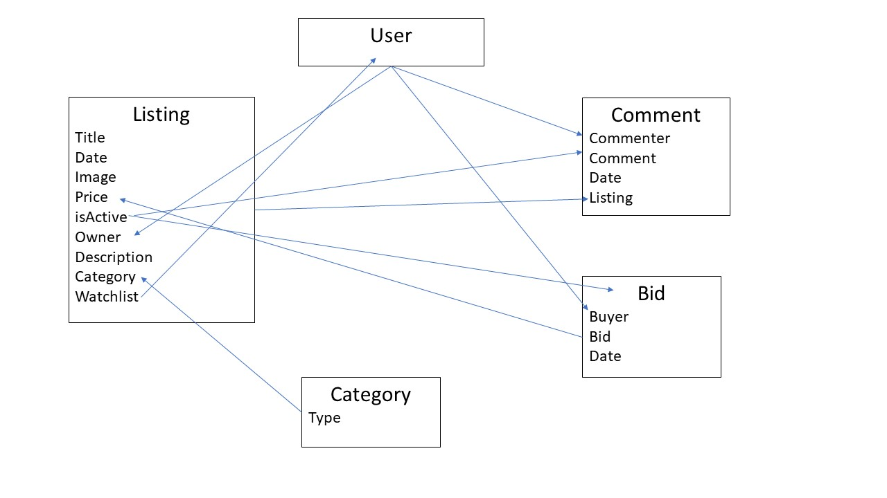
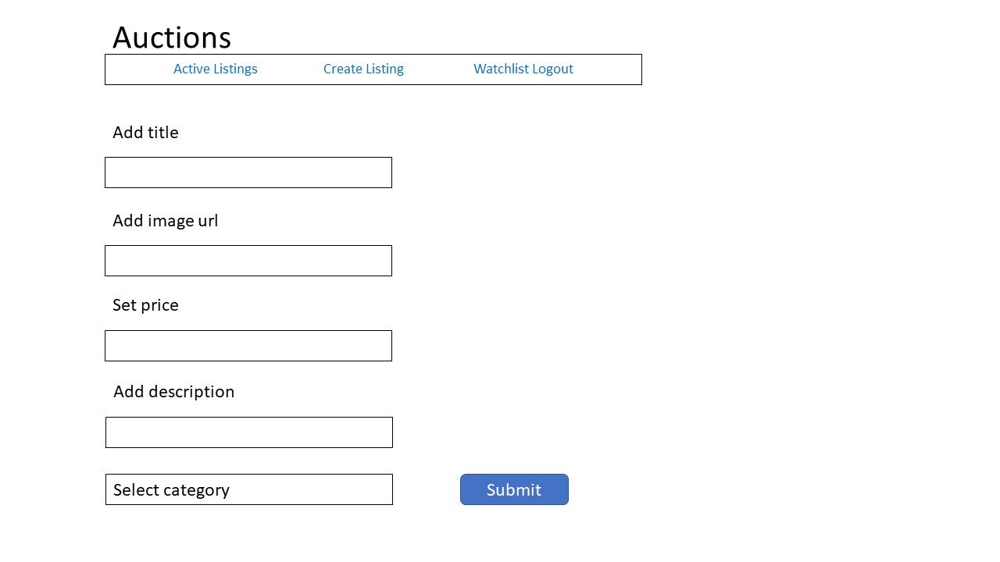
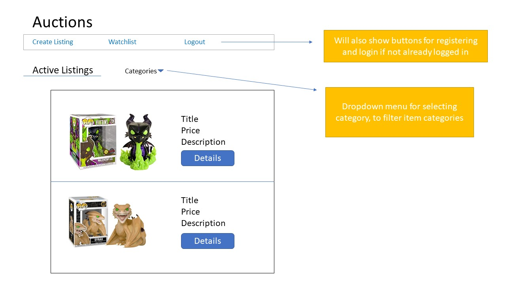
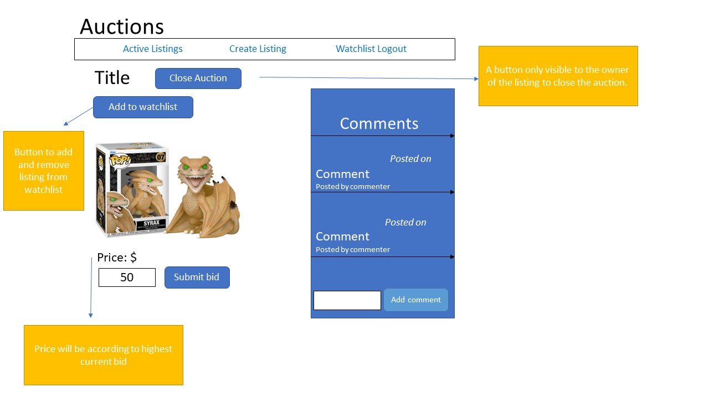

# Design Document Commerce

In this project a webpage will be constructed that will form a simplistic form of ebay.
On this page it will be possible to register an account, login and logout, see active listings, create new listings when logged in, bid and comment on listings and close and win auctions.

For this webpage classes will need to be created to form a database so objects on the webpage can interact and influence each other. These classes will be made in the file models.py. All necessary classes with their methods and how they need to interact are displayed in the graph below:

## Create Listing
Logged in users will be able to create new listings, with a starting price, description and image, as seen below. To upload the image a url of the image address will be entered instead of entering the image in the database. To make this page work a class Listing will need to be created, a path in urls, a function in views.py and a html page.

## Active listings
The homepage of this webpage will lead the user to a page that lists all the active listings, listings who’s auctions have not yet been closed. On this page a user looking through the listings will also be able to select a category after which only items assigned that category will be shown.
The Listings on this page will be shown on cards on which a picture of the listed item can be seen. A title, price and small description will also be shown on this card.
The webpage will roughly look as follows:

## Listing Page
When a user clicks on Details, the user will be sent to the Listing page of the item in question. On this page a picture of the item, the title, and price will again be listed. If a user is logged in when visiting this page, a comment section and bidding section will also appear. 
A logged in user will be able to enter a comment and or enter a bid on the item. When a bid is placed higher than the current price, the price will be updated to the amount of the bid.
The owner of said item will also be able to see and press a button to close the auction. The user with the highest bidding will then be shown a message to show they have won the auction.

